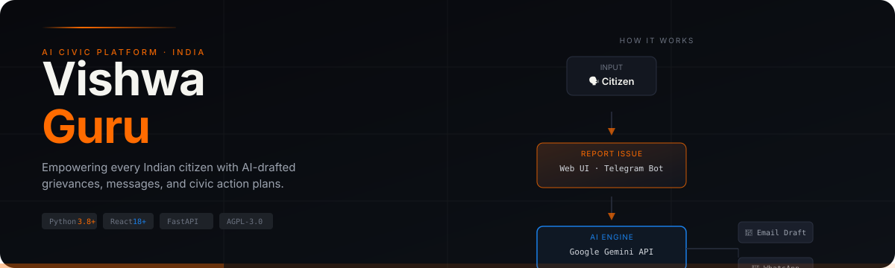
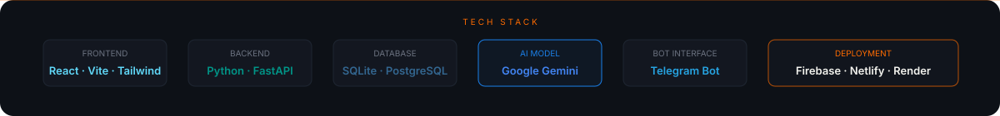

<p align="center">
  
</p>

<p align="center">
  <a href="https://github.com/RohanExploit/VishwaGuru/stargazers">
    
  </a>
  <a href="https://github.com/RohanExploit/VishwaGuru/issues">
    
  </a>
  
  
  
  
  
</p>

---

## What is VishwaGuru?

VishwaGuru is an open-source platform that makes civic action effortless for Indian citizens. You describe a local issue — a broken road, a water problem, a safety concern — and the AI generates a ready-to-send WhatsApp message, a formal email, and a full action plan targeting the right official.

> **Mission:** Make democracy accessible to every Indian citizen through technology.

---

## How it works

```
Citizen describes issue  →  VishwaGuru AI (Gemini)  →  Action plan + draft messages
        │                                                        │
   Web UI or                                         WhatsApp · Email · Representative
   Telegram Bot                                            contact details
```

1. **Report** — submit an issue via the web interface or Telegram bot
2. **AI Analysis** — Gemini API identifies the issue type and responsible authority
3. **Action Plan** — receive a structured plan with ready-to-send messages in the right language

---

## Key Features

| Feature | Description |
|---------|-------------|
| 🤖 **AI Action Plans** | Gemini-powered drafts: WhatsApp messages, formal emails, step-by-step action guides |
| 📱 **Multi-Platform** | Report via modern React web app or Telegram bot — no learning curve |
| 🏛 **India-Centric** | Built around Indian governance structure, representatives, and languages |
| ⚡ **Production-Ready** | SQLite for local dev, PostgreSQL for production; Firebase/Netlify/Render deploy |
| 🔒 **Open Source** | AGPL-3.0 — free, transparent, and community-driven |

---

## Tech Stack

<p align="center">
  
</p>

---

## Quick Start

### 1 · Clone

```bash
git clone https://github.com/RohanExploit/VishwaGuru.git
cd VishwaGuru
```

### 2 · Configure environment

```bash
cp .env.example .env
```

Edit `.env`:

```env
TELEGRAM_BOT_TOKEN=your_bot_token
GEMINI_API_KEY=your_api_key
DATABASE_URL=sqlite:///./data/issues.db
```

### 3 · Backend

```bash
# Create virtual environment
python -m venv venv
venv\Scripts\activate          # Windows
# source venv/bin/activate     # Linux / macOS

pip install -r backend/requirements.txt

# Run (Windows)
set PYTHONPATH=backend & python -m uvicorn main:app --reload
```

Backend runs at `http://localhost:8000`

### 4 · Frontend

```bash
cd frontend
npm install
npm run dev
```

Frontend runs at `http://localhost:5173`

---

## Running Services

| Service | Command | URL |
|---------|---------|-----|
| Backend | `set PYTHONPATH=backend & python -m uvicorn main:app --reload` | `http://localhost:8000` |
| Frontend | `cd frontend && npm run dev` | `http://localhost:5173` |

---

## Deployment

| Platform | What deploys |
|----------|-------------|
| **Firebase** | Frontend hosting |
| **Netlify + Render** | Full-stack (static + API) |
| **Railway** | Containerized full-stack |

Deployment configs are in [`firebase.json`](./firebase.json), [`netlify.toml`](./netlify.toml), and [`render.yaml`](./render.yaml).

---

## Architecture

See [`ARCHITECTURE.md`](./ARCHITECTURE.md) for a full system diagram, data flow, and module breakdown.

---

## Contributing

Read [`CONTRIBUTING.md`](./CONTRIBUTING.md) for branch naming, commit style, and PR checklist.

---

## Contributors

- **[RohanExploit](https://github.com/RohanExploit)** — Creator & maintainer

---

## License

GNU Affero General Public License v3.0 — see [`LICENSE`](./LICENSE) for details.
